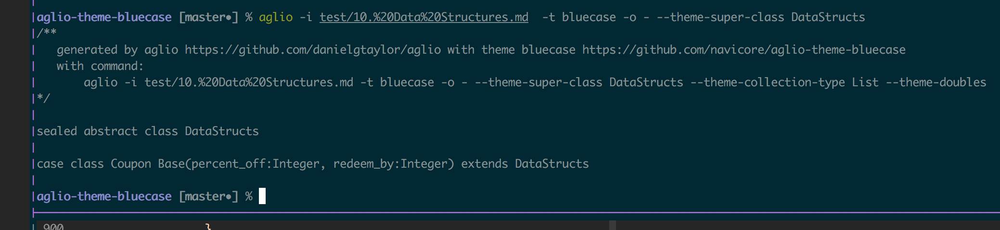

# aglio-theme-bluecase
An [Aglio Blueprint Renderer](https://github.com/danielgtaylor/aglio) theme to generate Scala case classes from `object` `datastructure` entries found in [api-blueprint](https://apiblueprint.org) specifications.

### *caveat*
*Works for my initial specific apib files - I haven't debugged using other apib files, yet.*
*I have not studied the parsed form from aglio to know what profound misunderstandings I'm holding - I have some assumptions that some content arrays have just one entry, etc...*

## INSTALL
1. `git clone https://github.com/navicore/aglio-theme-bluecase.git`
2. `cd aglio-theme-bluecase`
3. `npm install -g .`
4. `npm install -g aglio`

## USE

* `aglio -i tmp/mystructs.apib -t bluecase -o -`
* `aglio -i tmp/mystructs.apib -t bluecase -o -  --theme-superclass MyCases   > tmp/MyCases.scala`
* `aglio -i tmp/mystructs.apib -t bluecase -o -  --theme-superclass MyCases --theme-doubles lat,lon   > tmp/MyCases.scala`
* `aglio -i tmp/mystructs.apib -t bluecase -o tmp/MyGreatCases  --theme-superclass MyGreatCases --theme-doubles lat,lon`

License
=======
Copyright (c) 2016 Ed Sweeney

http://dgt.mit-license.org/

